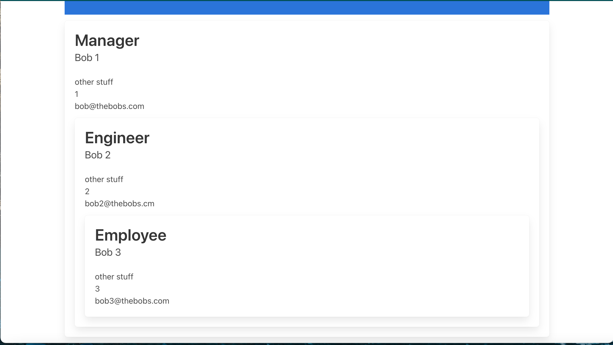

# team-profile-generator
an app to help you build a team profile page

## Description
This is a command line application that renders an html page for your dev team. 

## Technologies Used
- Node.js
- inquirer
- fs
- Javascript
- HTML

## Install
Clone repo. Run "npm i" to install packages. Use command "node index.js" to start the command line prompts. 

## License Info 
[License](./LICENSE)

## Links
[Repo](https://github.com/a-andres1/team-profile-generator)

## Contact Info
[email me](mailto:alyssaandres1@gmail.com)  
[find me on github](https://github.com/a-andres1)
